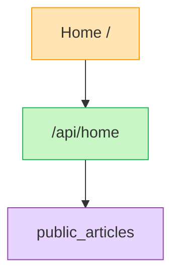

# Mermaid 図のルール

最終更新: 2026-03-22

このプロジェクトで Mermaid 図を作成・更新するときは、以下のルールを守る。

---

## 1. 色分けの凡例

ノードの種別に応じて `classDef` で統一した色を使う。

| 種別 | fill | stroke | 用途例 |
|---|---|---|---|
| 画面 / 遷移 | `#ffe5b4` | `#f90` | ページ、モーダル、画面遷移 |
| API / | `#c8f7c5` | `#27ae60` | API ルート（/api/...）|
| 状態 / 管理 | `#ffd6d6` | `#e74c3c` | バッチジョブ、admin_operation_logs |
| DB / 永続データ | `#e8d5ff` | `#8e44ad` | テーブル、DB リソース |
| 共通UI / モジュール | `#a0f4ff` | `#00b4d8` | タグ系テーブル、共有モジュール |

## 2. 書き方の基本

- `classDef` を図の先頭に必ず書く
- `color:#333` を全クラスに含めてテキストを読みやすくする
- ノードに `:::クラス名` でスタイルを付与する

## 3. 方向

- `flowchart TD`（上→下）: 画面遷移・UI フロー
- `flowchart LR`（左→右）: データフロー・パイプライン

## 4. ノード名のルール

- DB テーブルはテーブル名をそのまま使う: `["public_articles"]`
- API は URL パスをそのまま使う: `["/api/home"]`
- 画面はルートパスを含める: `["Home /"]`、`["Article Detail /articles/:id"]`

## 5. 対象ファイル

- `docs/imp/screen-flow.md` — 画面遷移・API 接続
- `docs/imp/data-flow.md` — データパイプライン・cron フロー
- その他 `docs/` 配下で Mermaid を使う場合も同じルールを適用する
