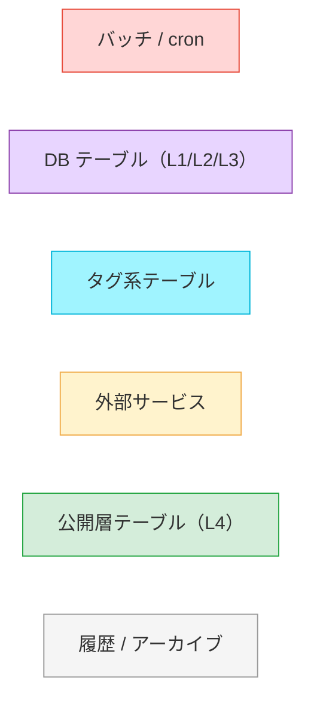
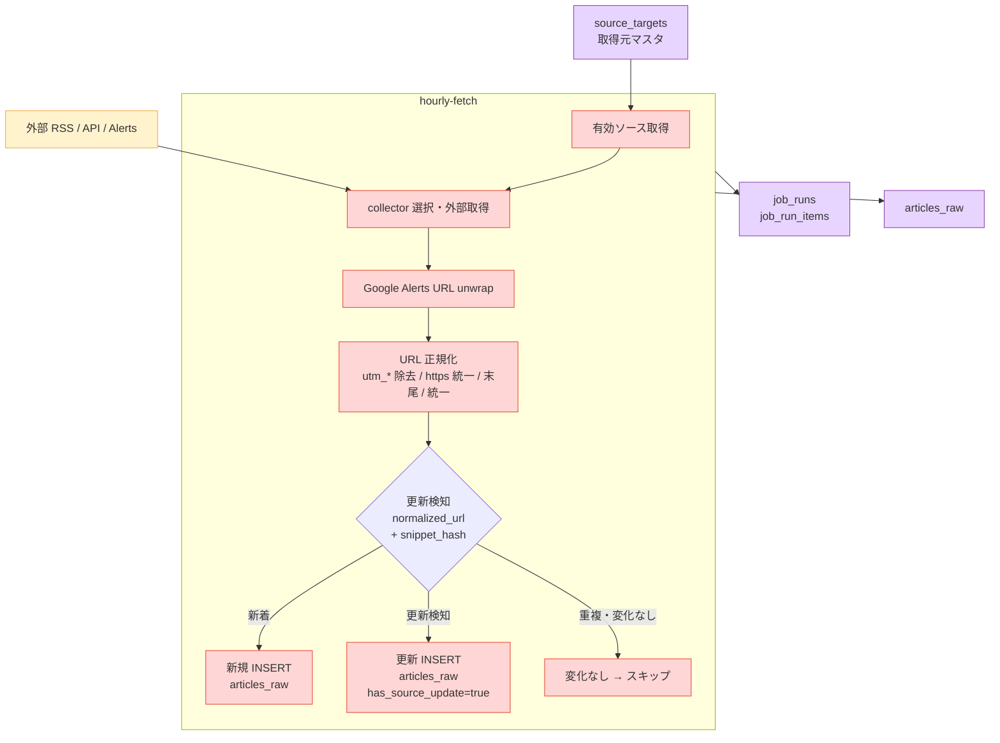
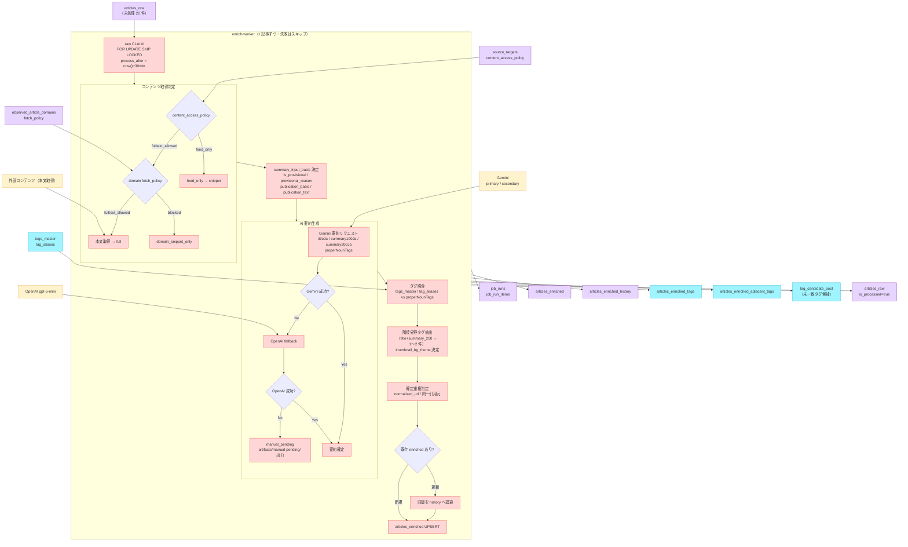
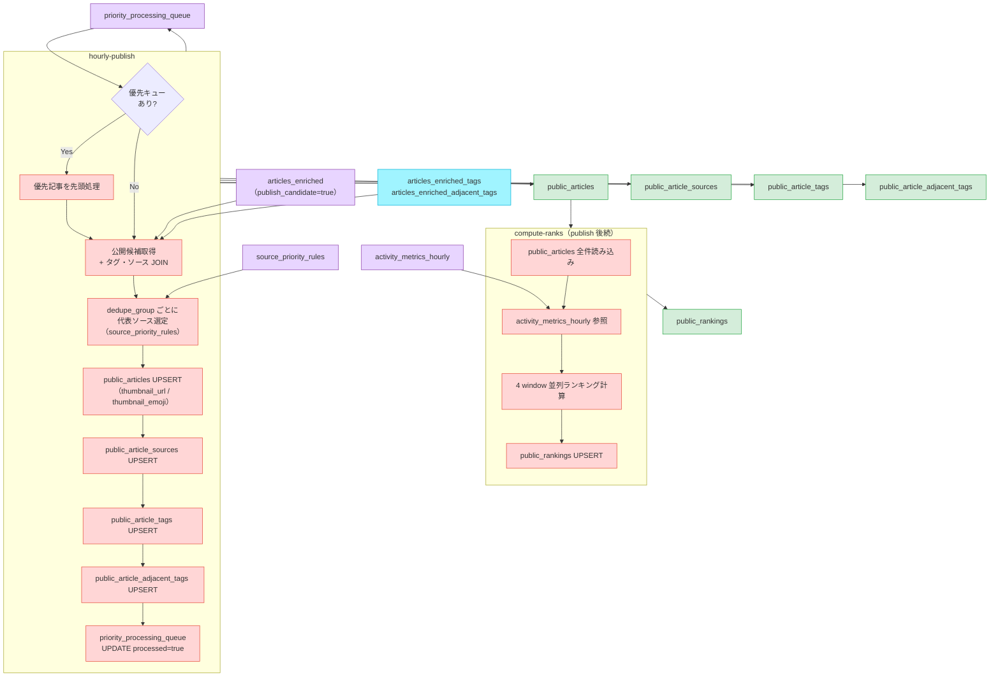
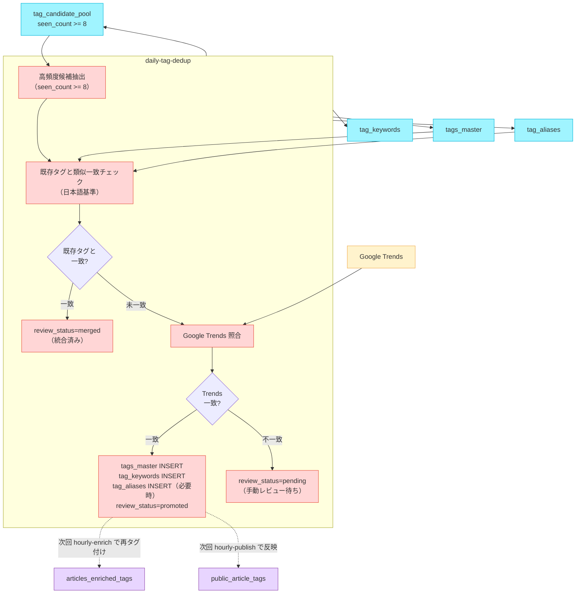
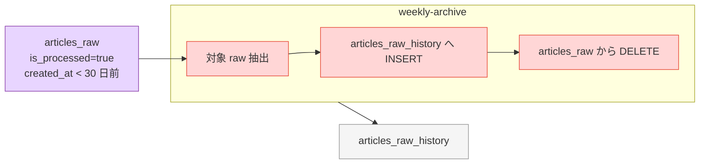
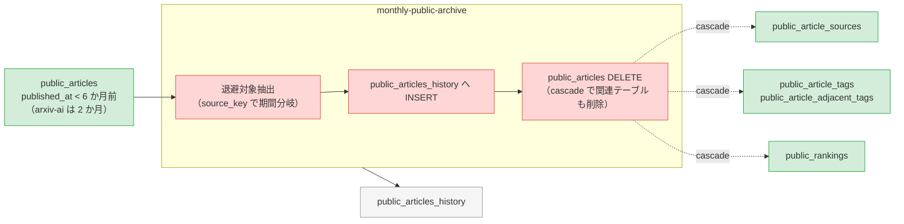
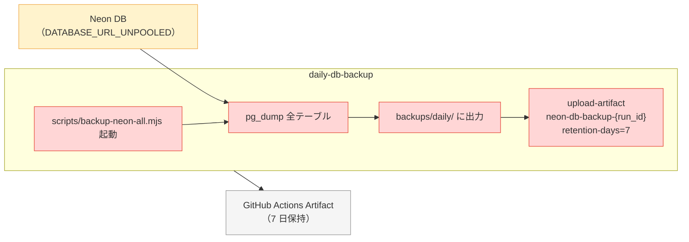

# バッチ別データフロー図

最終更新: 2026-04-01

各定時バッチの入出力テーブルと内部処理分岐を flowchart で示す。
処理順の詳細は `batch-sequence.md`、全体俯瞰は `flowchart.md` を参照。

凡例（全図共通）:

---

## 1. hourly-fetch（毎時 :00）

---

## 2. enrich-worker / hourly-enrich（毎時 :05〜:40）

---

## 3. hourly-publish + compute-ranks（毎時 :50）

---

## 4. daily-tag-dedup（毎日 02:30 UTC）

---

## 5. weekly-archive（週次）

---

## 6. monthly-public-archive（月次）

---

## 7. daily-db-backup（毎日 18:15 UTC）

