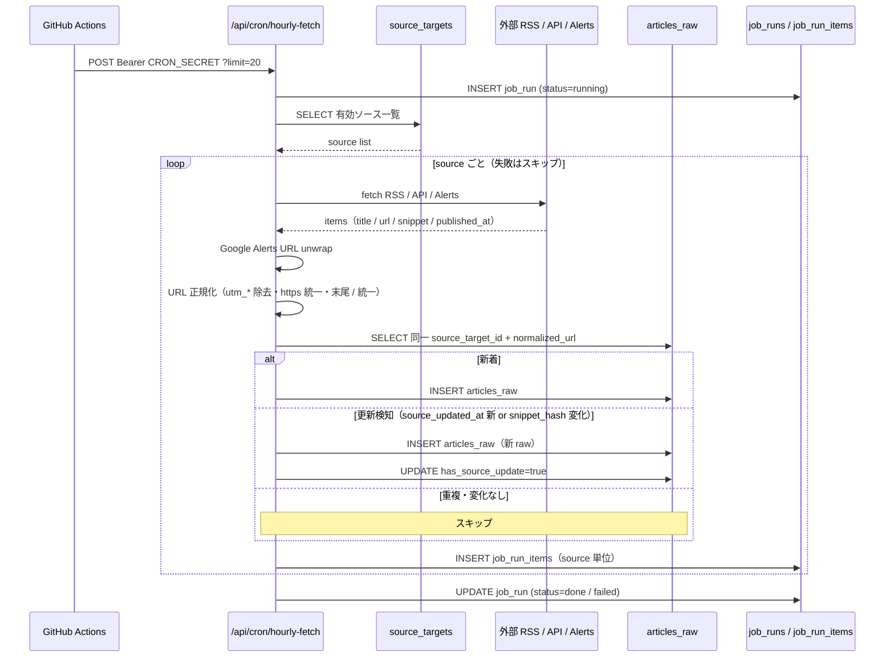
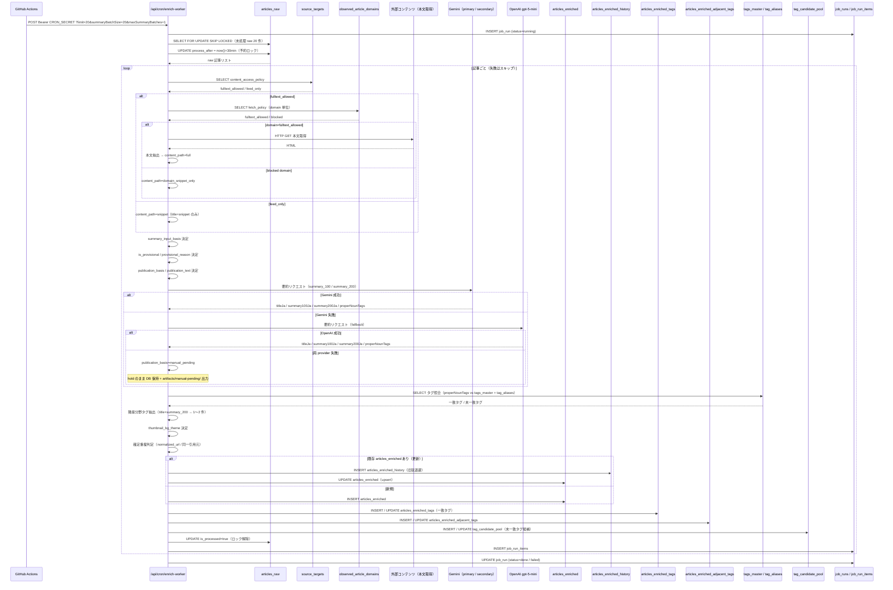
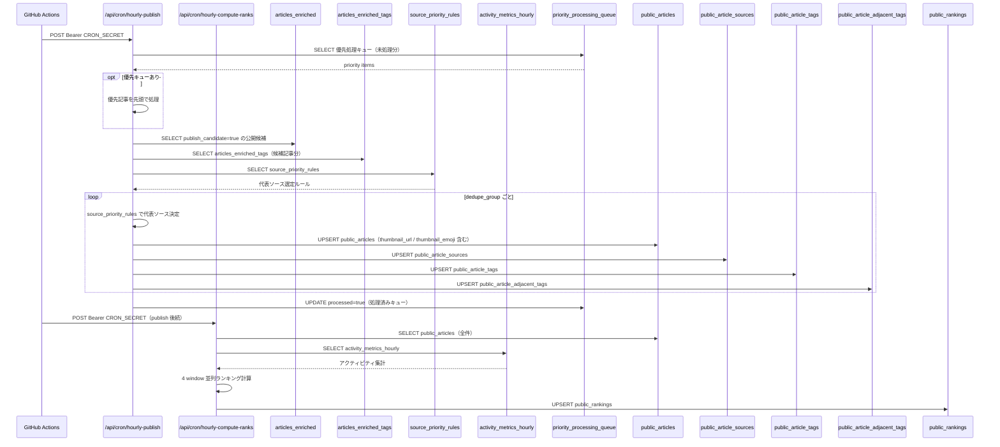
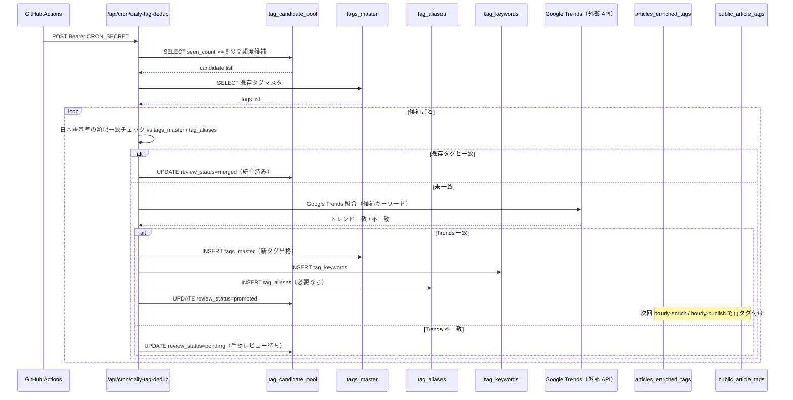
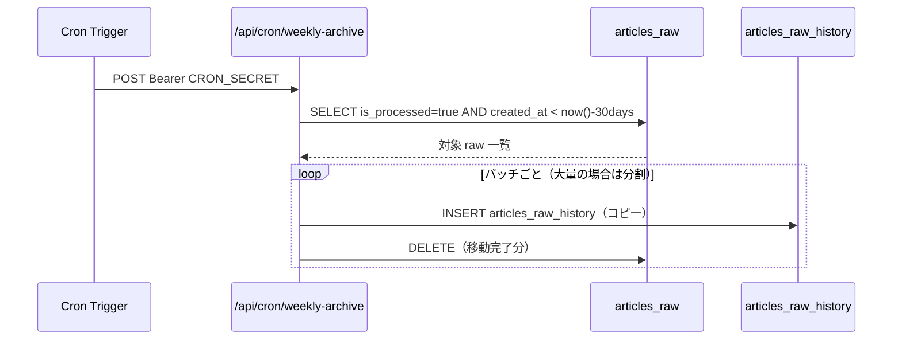
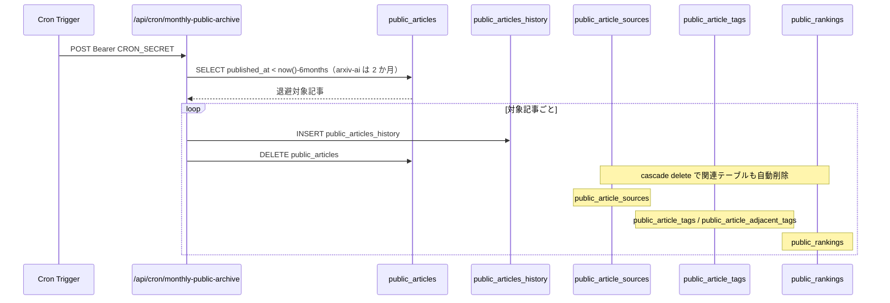
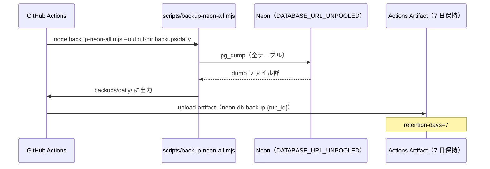

# バッチ別データフロー / シーケンス図

最終更新: 2026-04-01

各定時バッチの入出力テーブルと処理順を sequenceDiagram で示す。
全体の俯瞰図は `flowchart.md` を参照。

---

## 1. hourly-fetch（毎時 :00）

外部ソースから記事を取得し `articles_raw` へ投入する。

---

## 2. enrich-worker / hourly-enrich（毎時 :05〜:40、8 回）

`articles_raw` を AI 要約・タグ照合して `articles_enriched` を生成する。
1 回 20 件・`summaryBatchSize=20`・`maxSummaryBatches=1` で小分け実行。

---

## 3. hourly-publish + compute-ranks（毎時 :50）

`articles_enriched` を公開層 `public_articles` へ反映し、ランキングを再計算する。

---

## 4. daily-tag-dedup（毎日 02:30 UTC）

タグ候補を既存タグマスタと照合し、統合・昇格・保留を振り分ける。

---

## 5. weekly-archive（週次）

`articles_raw` の 1 か月超データを履歴テーブルへ退避する。

---

## 6. monthly-public-archive（月次）

`public_articles` の半年超データを履歴テーブルへ退避する（arxiv-ai は 2 か月上限）。

---

## 7. daily-db-backup（毎日 18:15 UTC）

Neon DB 全テーブルを `pg_dump` でバックアップし、GitHub Actions artifact として保存する。

