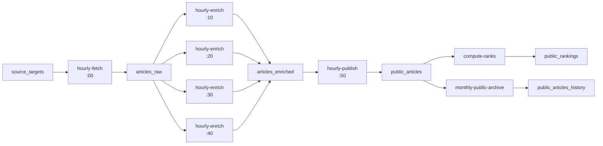

# AI Trend Hub Data Flow

最終更新: 2026-03-21

## 1. 目的

cron、L1/L2/L4、ランキング、月次アーカイブのデータフローを整理するための資料。

## 2. レイヤー

1. L1: `articles_raw`
2. L2: `articles_enriched`
3. L3: `activity_logs`, `activity_metrics_hourly`, `admin_operation_logs`
4. L4: `public_articles`, `public_article_tags`, `public_article_sources`, `public_rankings`
5. History: `articles_raw_history`, `articles_enriched_history`, `public_articles_history`

## 3. cron / job フロー

## 4. enrich worker の仕様

1. `daily-enrich` route を worker として使う
2. 1 回 10 件
3. `summaryBatchSize = 10`
4. `maxSummaryBatches = 1`
5. claim は `FOR UPDATE SKIP LOCKED`
6. 予約ロックは `process_after = now() + 30 minutes`

## 5. publish / ranking

1. `hourly-publish` は L2 の publish candidate を `public_articles` へ upsert
2. `public_article_tags` と `public_article_sources` を同期
3. `compute-ranks` は `public_articles` と `activity_metrics_hourly` を起点に `public_rankings` を再計算
4. `compute-ranks.maxDuration = 300`

## 6. L4 月次アーカイブ

1. `public_articles` は半年以内の公開集合
2. 半年超は `monthly-public-archive` で `public_articles_history` に退避
3. `public_article_tags` / `public_article_sources` / `public_rankings` は cascade delete
4. 初回実行で 1073 件を archive 済み

## 7. 現在の未解決

1. `public_article_sources` 同期不備
2. `compute-ranks` 根本軽量化
3. admin Phase 3

## 8. 監視ポイント

1. GitHub Actions run
2. Vercel function logs
3. `job_runs`
4. `articles_raw.process_after`, `is_processed`, `last_error`
5. `public_articles`, `public_articles_history`, `public_rankings`
