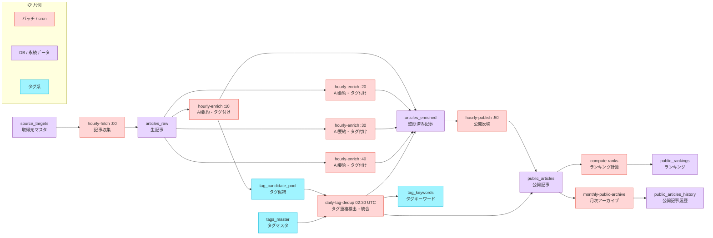

# AI Trend Hub Data Flow

最終更新: 2026-03-22

## 1. 目的

cron、L1/L2/L4、ランキング、月次アーカイブ、タグ管理のデータフローを整理するための資料。

## 2. レイヤー

1. L1: `articles_raw`
2. L2: `articles_enriched`, `articles_enriched_tags`, `articles_enriched_sources`
3. L3: `activity_logs`, `activity_metrics_hourly`, `admin_operation_logs`, `job_runs`
4. L4: `public_articles`, `public_article_tags`, `public_article_sources`, `public_rankings`
5. History: `articles_raw_history`, `articles_enriched_history`, `public_articles_history`
6. Tag: `tags_master`, `tag_keywords`, `tag_aliases`, `tag_candidate_pool`

## 3. cron / job フロー



## 4. enrich worker の仕様

1. `daily-enrich` route を worker として使う（GitHub Actions から呼び出し）
2. 1 回 10 件、`summaryBatchSize = 10`、`maxSummaryBatches = 1`
3. claim は `FOR UPDATE SKIP LOCKED`、予約ロックは `process_after = now() + 30 minutes`
4. AI 出力: `titleJa`（en ソースのみ日本語変換）、`summary100Ja`、`summary200Ja`、`properNounTags`
5. `properNounTags` は `tag_candidate_pool` に蓄積される候補タグの源泉

## 5. publish / ranking

1. `hourly-publish` は L2 の publish candidate を `public_articles` へ upsert
2. `public_article_tags` と `public_article_sources` を同期（unnest bulk upsert）
3. `compute-ranks`: `public_articles` を 1 回読み込み → 4 window を Promise.all で並列計算 → ON CONFLICT upsert
4. `compute-ranks` は `hourly-publish` の後続ステップとして同一 workflow 内で実行

## 6. L4 月次アーカイブ

1. `public_articles` は半年以内の公開集合
2. 半年超は `monthly-public-archive` で `public_articles_history` に退避
3. `public_article_tags` / `public_article_sources` / `public_rankings` は cascade delete

## 7. タグ管理フロー

```
enrich 時: properNounTags → tag_candidate_pool に蓄積
      ↓
daily-tag-dedup（毎日 02:30 UTC）
  - seen_count >= 4 の候補を Gemini で既存タグと照合
  - high 信頼度マッチ → tag_keywords に追加 + articles に遡及タグ付け + status='promoted'
  - マッチなし → 'candidate' のまま管理画面レビュー待ち
      ↓
管理画面 /admin/tags
  - 未マッチ候補のレビュー（昇格 / 保留 / 棄却）
  - 昇格時: tags_master 登録 + tag_keywords 登録 + 遡及タグ付け（L2/L4）
```

### tag_key 命名規則

- `tag_key`: lowercase, hyphen-separated（URL-safe）例: `nano-banana`
- `display_name`: ユーザー表示用（例: `Nano Banana`）
- `tag_keywords`: テキストマッチ用（スペースあり表記も可）例: `nano banana`
- 大文字小文字は case-insensitive で自動吸収

## 8. 監視ポイント

1. `/admin/jobs`: fetch / enrich / publish / compute-ranks / daily-tag-dedup の実行ログ
2. GitHub Actions run（job 起動失敗の検知）
3. `articles_raw.process_after`, `is_processed`, `last_error`
4. `public_articles`, `public_articles_history`, `public_rankings`
