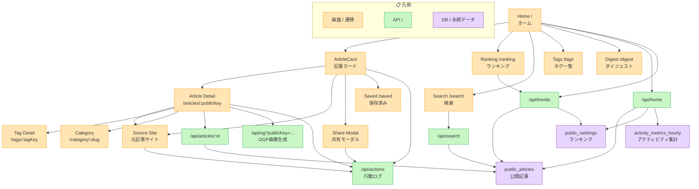
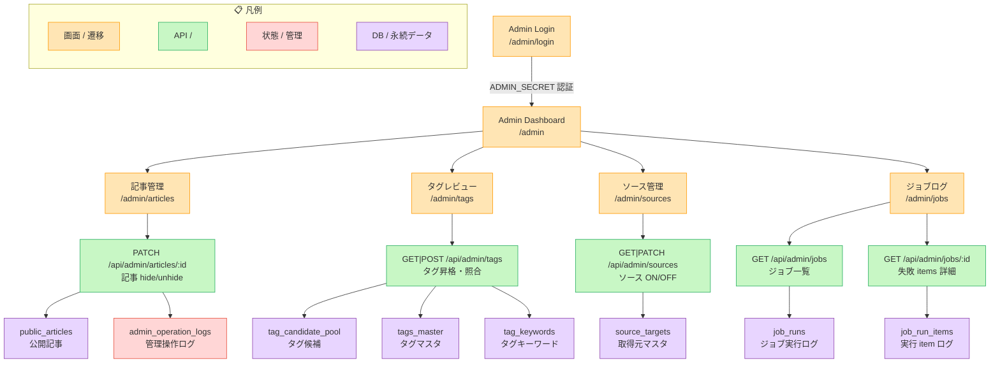
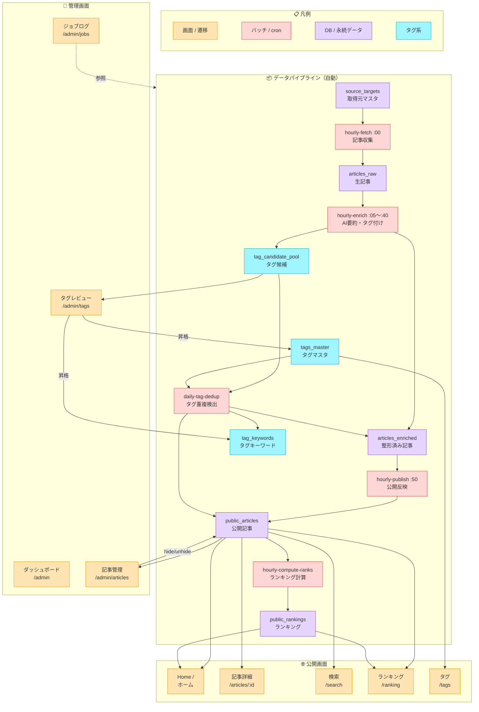
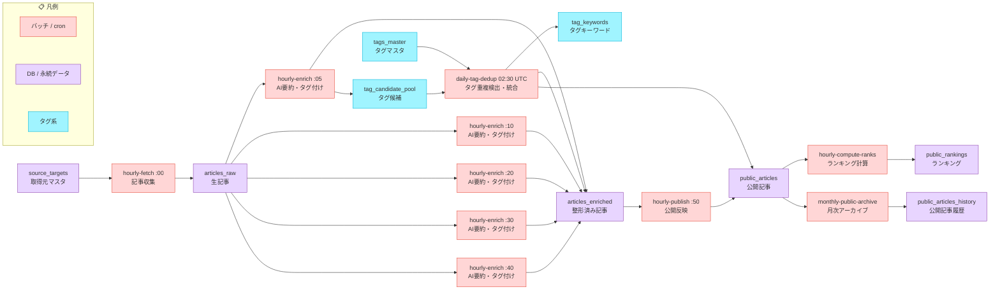
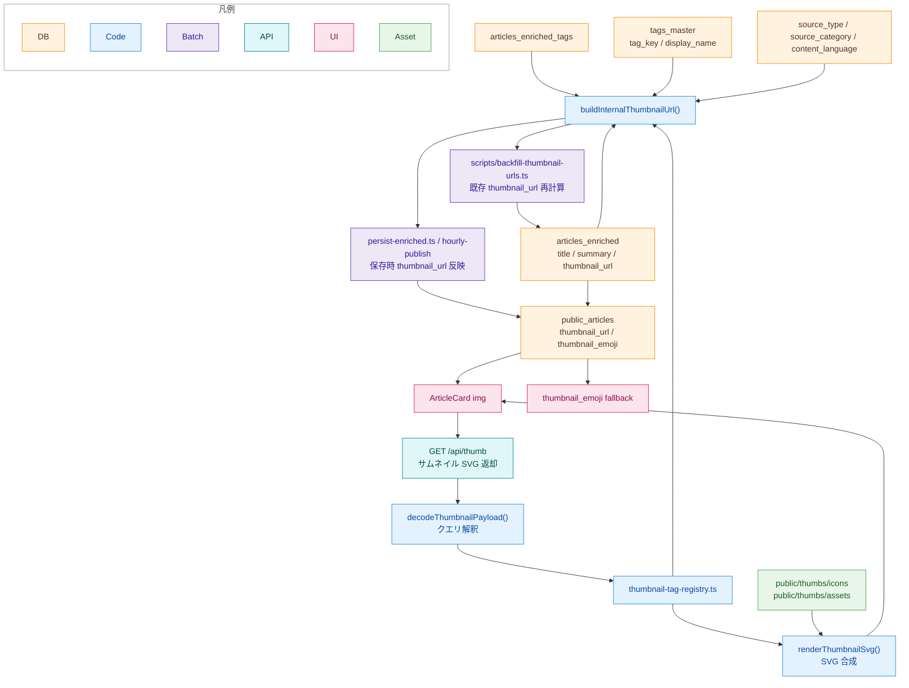
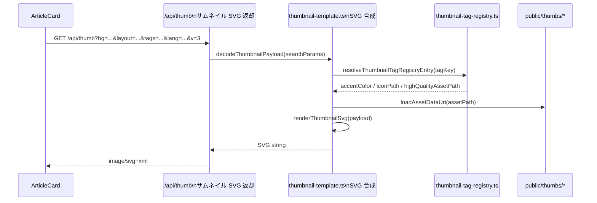
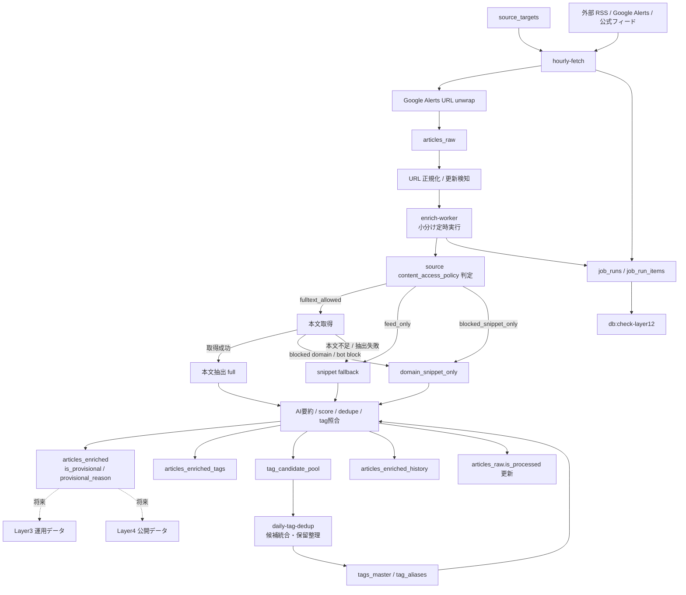
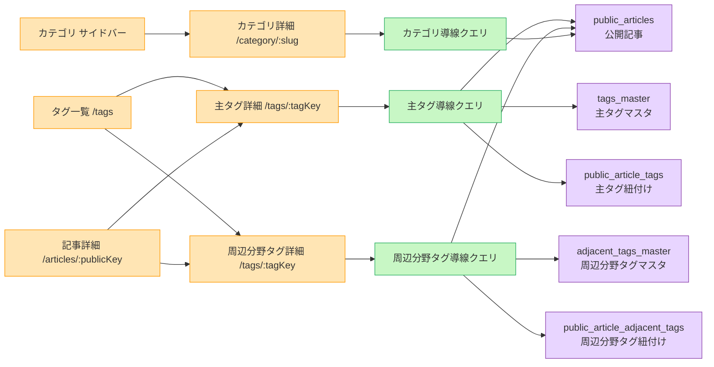

# AI Trend Hub Flowchart

最終更新: 2026-04-02

このファイルには Mermaid 図だけを集約する。図の補足説明は元ファイル側へ残す。

## 1. 公開面の画面遷移と API 接続

## 2. 管理面の画面遷移と API 接続

## 3. 統合図

## 4. cron / job フロー

## 5. サムネイル生成フロー

## 6. サムネイル描画シーケンス

## 7. Layer2 フロー（現行名称）

## 8. 公開導線 vNext Draft

```mermaid
flowchart TD
    classDef screen fill:#ffe5b4,stroke:#f90,color:#333
    classDef api    fill:#c8f7c5,stroke:#27ae60,color:#333
    classDef admin  fill:#ffd6d6,stroke:#e74c3c,color:#333
    classDef db     fill:#e8d5ff,stroke:#8e44ad,color:#333
    classDef ui     fill:#a0f4ff,stroke:#00b4d8,color:#333

    Home["ホーム /"]:::screen --> Sidebar["カテゴリ サイドバー"]:::ui
    Home --> CardList["記事カード一覧"]:::ui
    Home --> Ranking["ランキング /ranking"]:::screen
    Home --> Search["検索 /search"]:::screen
    Home --> Tags["タグ一覧 /tags"]:::screen

    Sidebar --> CategoryOfficial["カテゴリ /category/official<br/>公式"]:::screen
    Sidebar --> CategoryNews["カテゴリ /category/news<br/>ニュース"]:::screen
    Sidebar --> CategoryPaper["カテゴリ /category/paper<br/>論文"]:::screen
    Sidebar --> CategorySearchRag["カテゴリ /category/search-rag<br/>Search / RAG"]:::screen
    Sidebar --> CategoryOss["カテゴリ /category/oss<br/>OSS"]:::screen
    Sidebar --> CategoryEnterprise["カテゴリ /category/enterprise-ai<br/>Enterprise AI"]:::screen

    CardList --> Detail["記事詳細 /articles/:publicKey"]:::screen
    CardList --> PrimaryTag["主タグ詳細 /tags/:tagKey"]:::screen
    CardList --> AdjacentTag["周辺分野タグ詳細 /tags/:tagKey"]:::screen

    Detail --> PrimaryTag
    Detail --> AdjacentTag
    Tags --> PrimaryTag
    Tags --> AdjacentTag
    CategoryOfficial --> Detail
    CategoryOfficial --> PrimaryTag
    CategoryOfficial --> AdjacentTag

    Home --> HomeApi["ホーム取得 API<br/>/api/home"]:::api
    Ranking --> TrendsApi["トレンド取得 API<br/>/api/trends"]:::api
    Search --> SearchApi["検索 API<br/>/api/search"]:::api
    Detail --> DetailApi["記事詳細 API<br/>/api/articles/:id"]:::api

    HomeApi --> PublicArticles["public_articles<br/>公開記事"]:::db
    HomeApi --> PublicRankings["public_rankings<br/>ランキング"]:::db
    HomeApi --> PublicTags["public_article_tags<br/>主タグ紐付け"]:::db
    HomeApi --> PublicAdjacentTags["public_article_adjacent_tags<br/>周辺分野タグ紐付け"]:::db
    HomeApi --> TagsMaster["tags_master<br/>主タグマスタ"]:::db
    HomeApi --> AdjacentMaster["adjacent_tags_master<br/>周辺分野タグマスタ"]:::db

    SearchApi --> PublicArticles
    TrendsApi --> PublicArticles
    TrendsApi --> PublicRankings
    DetailApi --> PublicArticles
    DetailApi --> PublicTags
    DetailApi --> PublicAdjacentTags
```

## 9. タグ導線 vNext Draft

