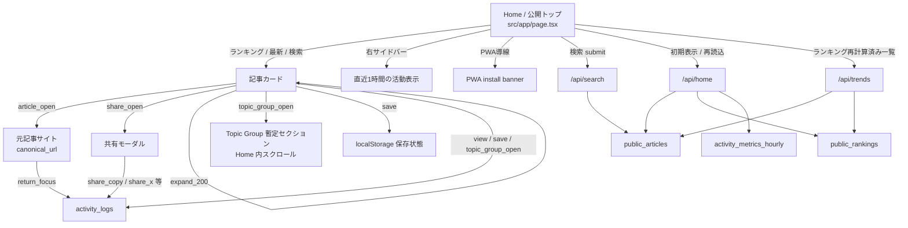
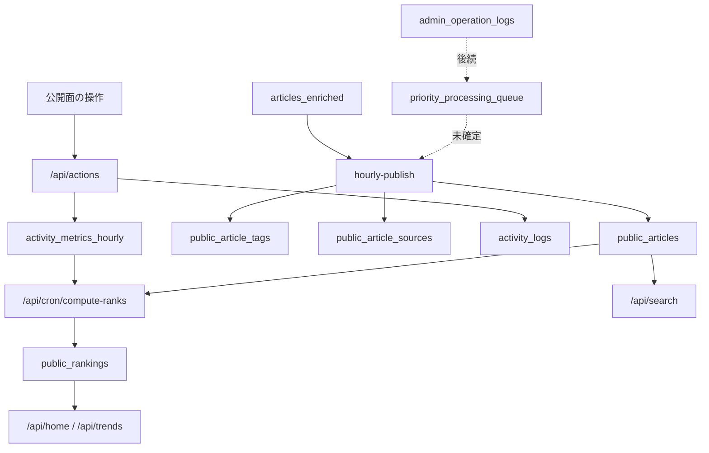

# AI Trend Hub L3/L4 画面遷移図

最終更新: 2026-03-17

## 1. このファイルの目的

L3/L4 実装を進める前提として、公開面と運用面の遷移を 1 枚で議論できる状態にする。  
「今どこまで実装済みか」「次にどの画面と API を繋ぐか」を、人と AI の両方が読みやすい形で固定する。

## 2. 現在の前提

1. 公開面は `layer4` のみを読む
2. `hourly-publish` により `public_articles` への転送は稼働済み
3. `public_rankings` はこのセッションで実装着手する
4. Topic Group の最終遷移は未確定のため、暫定導線を採用する
5. 管理画面は最小限に留め、未確定な運営操作は `implementation-wait.md` 管理とする

## 3. 公開面の遷移図

## 4. 運用面の遷移図

## 5. 画面ごとの責務

### 5.1 Home

1. `public_articles` の公開一覧を表示する
2. 初期表示は `/api/home` から取得する
3. KPI は `public_articles` 集計 + `activity_metrics_hourly` 集計を使う
4. 実データが空でもモックへ戻さず、空状態をそのまま出す

### 5.2 検索

1. `/api/search` を使い `public_articles` を検索する
2. `ILIKE` ベースで title / summary を検索する
3. 公開済み記事だけを対象にする

### 5.3 Topic Group

1. このセッションでは Home 内の暫定セクションに留める
2. 別画面遷移や専用 URL はまだ持たない
3. 最終仕様は `implementation-wait.md` に残す

### 5.4 共有

1. 共有操作は UI を止めない
2. ログは `activity_logs` と `activity_metrics_hourly` に送る
3. Misskey インスタンス設定はローカル保持する

## 6. 次に繋ぐ実装ポイント

1. `Home -> /api/home -> public_articles/public_rankings`
2. `公開面操作 -> /api/actions -> activity_logs/activity_metrics_hourly`
3. `activity_metrics_hourly -> /api/cron/compute-ranks -> public_rankings`
4. `public_rankings -> digest/send-digest`

## 7. 未確定でこのファイルに書かないもの

1. 管理画面の詳細なレイアウト
2. Topic Group の最終 URL 設計
3. `priority_processing_queue` の queue_type 別完全仕様
4. `activity_logs.action_type` の厳密な運用一覧

それらは `implementation-wait.md` で管理する。
