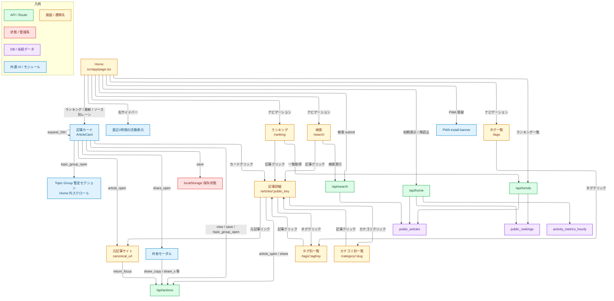
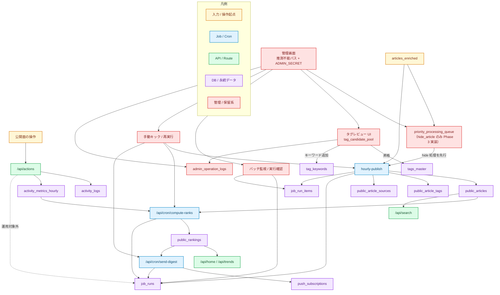
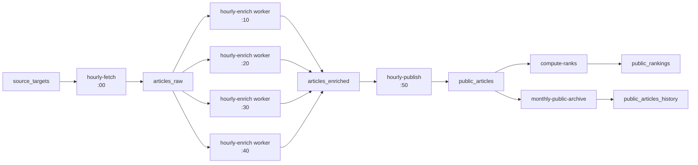

# AI Trend Hub L3/L4 画面遷移図

最終更新: 2026-03-17（Phase 2 公開ページ群の実装完了を反映、L3 運用フローを追加）

## 1. このファイルの目的

L3/L4 実装を進める前提として、公開面と運用面の遷移を 1 枚で議論できる状態にする。
「今どこまで実装済みか」「次にどの画面と API を繋ぐか」を、人と AI の両方が読みやすい形で固定する。

## 2. 現在の前提

1. 公開面は `layer4` のみを読む
2. `hourly-publish` により `public_articles` への転送は稼働済み（bulk 化は Phase 0 残件）
3. `public_rankings` は実装済み（`compute-ranks` cron 稼働中）
4. Phase 2 の公開ページ群（detail / category / tags / ranking / search 等）は実装済み
5. Topic Group の最終遷移は未確定のため、暫定導線（Home 内スクロール）を継続採用
6. 管理画面は Phase 3 で最小実装する（推測不能パス + トークン認証の二重防御）

## 3. 公開面の遷移図

## 4. 運用面の遷移図

## 5. 画面ごとの責務

### 5.1 Home

1. `public_articles` の公開一覧を表示する
2. 初期表示は `/api/home` から取得する
3. source lane（source_type 別）と topic chips（source_category / tag 別）を分離して表示する
4. KPI は `public_articles` 集計 + `activity_metrics_hourly` 集計を使う
5. 実データが空でもモックへ戻さず、空状態をそのまま出す

### 5.2 記事詳細（/articles/:public_key）

1. `public_key` を使って `public_articles` + `public_article_tags` + `public_article_sources` を取得する
2. `getPublicArticleDetail()` 経由で Layer4 だけを読む
3. 元記事リンク、タグ、カテゴリへの導線を持つ

### 5.3 検索（/search）

1. `/api/search` を使い `public_articles` を検索する
2. `ILIKE` ベースで title / summary を検索する
3. 公開済み記事だけを対象にする

### 5.4 ランキング（/ranking）

1. `/api/trends` から `public_rankings` を読んで一覧表示する
2. ランキングスコア順に記事を並べる

### 5.5 カテゴリ別（/category/:slug）

1. `source_category` をキーに `public_articles` をフィルタして表示する
2. slug は `source_category` の値に対応する

### 5.6 タグ（/tags, /tags/:tagKey）

1. `/tags`: `tags_master` から記事数上位のタグを一覧表示する
2. `/tags/:tagKey`: `public_article_tags` 経由で当該タグの記事一覧を表示する

### 5.7 About / Feed

1. `/about`: 静的ページ
2. `/feed`: RSS Atom フィードを `public_articles` から生成する

### 5.8 Topic Group

1. このフェーズでは Home 内の暫定セクションに留める
2. 別画面遷移や専用 URL はまだ持たない
3. 最終仕様は `implementation-wait.md` に残す

### 5.9 共有

1. 共有操作は UI を止めない
2. ログは `/api/actions` 経由で `activity_logs` と `activity_metrics_hourly` に送る
3. Misskey インスタンス設定はローカル保持する

### 5.10 管理画面（Phase 3）

1. 推測不能なパス（`ADMIN_PATH_PREFIX` env var で定義）+ `ADMIN_SECRET` トークン認証
2. 初期実装対象: `hide_article` 操作、タグレビュー UI
3. 操作はすべて `admin_operation_logs` に記録する

## 6. 実装済みポイントと残件

### 実装済み（2026-03-20 時点）

#### データ・バッチ層
1. `hourly-publish` の bulk upsert 化（unnest ベース）完了。L4 = 2371 件公開済み
2. migration 033: pgvector、`articles_enriched_sources`、`public_article_sources` 拡張
3. migration 034: `commercial_use_policy` を source_targets / observed_article_domains / articles_enriched に追加。ToS 調査結果を初期投入済み
4. `articles_enriched.commercial_use_policy` を enrich 時に自動判定・保存

#### 公開 API
5. `/api/home`: `{ random, latest, unique, lanes(official/paper/news), stats, activity }` 返却
6. `/api/search`: 公開記事の ILIKE 検索
7. `/api/trends`: `public_rankings` ベースのランキング
8. `/api/actions`: activity_logs + activity_metrics_hourly への記録（like/unlike 含む）
9. `/api/articles/[id]`: 単一記事の詳細取得（/saved, /liked ページ向け）
10. `/api/cron/compute-ranks`: ランキング再計算
11. `/api/cron/send-digest`: ダイジェスト送信

#### 公開ページ群
12. `/`（Home）: ランダム表示・新着順・ユニーク順の 3 セクション + ソースレーン（official/paper/news）
13. `/articles/:publicKey`: 記事詳細（public_articles + public_article_tags + public_article_sources）
14. `/ranking`: public_rankings ベースのランキング
15. `/search`: ILIKE 全文検索
16. `/tags`: tags_master 集計一覧
17. `/tags/:tagKey`: public_article_tags 経由の記事一覧
18. `/category/:slug`: source_category または source_type によるフィルタ
19. `/about`: 静的ページ
20. `/feed`: RSS Atom フィード
21. `/digest`: ランキング上位記事のダイジェスト（200字表示）
22. `/saved`: localStorage の savedArticleIds から記事を取得・表示
23. `/liked`: localStorage の likedArticleIds から記事を取得・表示

#### UI コンポーネント
24. `ArticleCard`: 100字前提サイズ、カードクリック→200字サマリーモーダル、☆高評価ボタン
25. `ArticleRow`: ソースレーン用コンパクト横一行表示
26. `Header`: 通知ドロップダウン、虫眼鏡アイコン、スクロール auto-hide（mobile）
27. `RightSidebar`: source_category ナビ（/category/:slug）、みんなの活動（1h閲覧/シェア数）
28. `Toolbar`: 期間フィルタ（24時間/1週間/1か月）、セクションスクロールナビ
29. `BottomNav`: モバイル専用ボトムナビゲーション（md:hidden）

#### 共有モーダル
30. URLコピー / 紹介文コピー の 2 ボタン方式
31. ✅#AiTrendHub / ✅タイトル / ✅100字要約 のカスタムチェックボックス
32. 紹介文 URL は `/articles/:publicKey` の絶対 URL を使用

### 残件（Phase 3）

1. 管理画面基盤（推測不能パス + ADMIN_SECRET トークン二重認証）
2. `priority_processing_queue → hourly-publish` の実線化（hide_article のみ）
3. タグレビュー UI（tag_candidate_pool → tags_master 昇格）
4. `source_targets.is_active` ON/OFF スイッチ（admin UI）
5. `activity_logs.action_type` 正式マッピング確定 → `compute-ranks` 係数調整
6. 日本語ソース追加（14 件候補あり、imp-hangover.md 13.4 参照）
7. `content_language` カラム追加 + ArticleCard の JP/EN バッジ表示
8. SNS シェアボタン（後発 imp-plan として保留）
9. 批評（critique）UI の有効化

## 7. 未確定でこのファイルに書かないもの

1. 管理画面の詳細なレイアウト
2. Topic Group の最終 URL 設計
3. `priority_processing_queue` の queue_type 別完全仕様（hide 以外）
4. `activity_logs.action_type` の厳密な運用一覧（`share_open` / `return_focus` / `unsave` の扱い）

それらは `implementation-wait.md` で管理する。
## 2026-03-21 追記: Cron 分離後の関係図

### A. データパイプライン

### B. 運用上の要点

1. `hourly-layer12` の一括実行は timeout 対策のため実質廃止し、`fetch` と `enrich` を分離した。
2. enrich は `daily-enrich` route を worker として使い、1 回 10 件だけ claim して処理する。
3. claim は `articles_raw.process_after` を予約ロックとして使い、`FOR UPDATE SKIP LOCKED` で重複取得を避ける。
4. `hourly-publish` は `public_articles` だけを更新し、`compute-ranks` は同 workflow 内の後続 step のまま。
5. `public_articles` は半年以内の公開集合として保ち、半年超は `public_articles_history` に月次退避する。

### C. 現在の定期実行スケジュール

| ジョブ | 時刻 | 役割 |
|---|---|---|
| `hourly-fetch` | 毎時 `:00` | raw 収集 |
| `hourly-enrich` | 毎時 `:10 / :20 / :30 / :40` | 10 件 worker |
| `hourly-publish` | 毎時 `:50` | L2 -> L4 公開 |
| `compute-ranks` | `hourly-publish` 後続 | `public_rankings` 再計算 |
| `monthly-public-archive` | 手動実装済み・月次想定 | 半年超 L4 の履歴退避 |

### D. 追加で見るべきテーブル

1. `articles_raw`
   - enrich worker の claim 対象
   - `is_processed`, `process_after`, `last_error` を監視
2. `public_articles`
   - 公開集合本体
3. `public_articles_history`
   - 月次 age-out の退避先
4. `public_rankings`
   - `compute-ranks` 出力先
