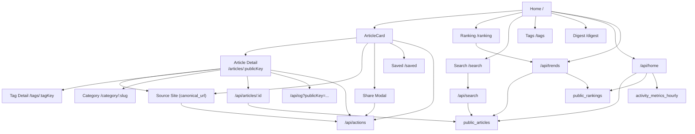
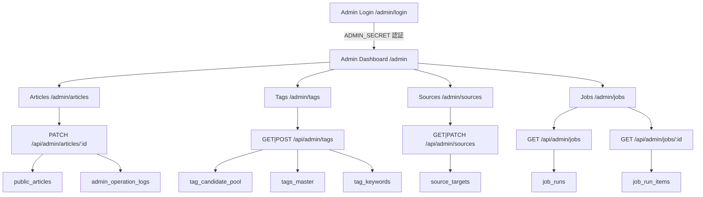

# AI Trend Hub Screen Flow

最終更新: 2026-03-22

## 1. 目的

公開画面・管理画面の導線、主要 API、L4 接続点を一枚で把握するための資料。

## 2. 主要画面

### 公開面
1. Home `/`
2. Ranking `/ranking`
3. Search `/search`
4. Article Detail `/articles/:publicKey`
5. Category `/category/:slug`
6. Tags `/tags`, `/tags/:tagKey`
7. About `/about`
8. Feed `/feed`, `/feed.xml`
9. Digest `/digest`
10. Saved `/saved`
11. Liked `/liked`

### 管理面
12. Admin Login `/admin/login`
13. Admin Dashboard `/admin`
14. Admin Articles `/admin/articles`
15. Admin Tags `/admin/tags`
16. Admin Sources `/admin/sources`
17. Admin Jobs `/admin/jobs`

## 3. 公開面の画面遷移と API 接続

## 4. 管理面の画面遷移と API 接続

## 5. 画面別の読み先

### 5.1 Home
- `public_articles`（random / latest / unique / ranked / lanes）
- `public_rankings`
- `activity_metrics_hourly`

### 5.2 Article Detail
- `public_articles`
- `public_article_tags`
- `public_article_sources`
- OGP: `/api/og` で動的画像生成（`@vercel/og`、edge runtime）

### 5.3 Ranking
- `public_rankings`
- `public_articles`

### 5.4 Search
- `public_articles`（ILIKE 全文検索）

### 5.5 Tags / Category
- `tags_master`
- `public_article_tags`
- `public_articles`

### 5.6 Admin Articles
- `public_articles`（最新200件）
- PATCH で `visibility_status` を即時更新 + revalidation

### 5.7 Admin Tags
- `tag_candidate_pool`（seen_count >= 4, status='candidate'）
- 昇格: `tags_master` + `tag_keywords` + `articles_enriched_tags` + `public_article_tags`

### 5.8 Admin Sources
- `source_targets`（全件）

### 5.9 Admin Jobs
- `job_runs`（最新50件、フィルタ可）
- `job_run_items`（失敗 items のみ、クリックで展開）

## 6. 現在の前提

1. `public_articles` は半年以内の公開集合
2. 半年超は `public_articles_history` に月次退避
3. `content_language` は公開面まで反映済み（JP/EN バッジ表示）
4. `thumbnail_url` は内部テンプレサムネイル方式（`/api/thumb`）
5. OGP 画像は `/api/og` で動的生成（`summary_large_image`）
6. 管理面は `/admin/login` で `ADMIN_SECRET` 認証後に全画面アクセス可
7. Topic Group は Home 内セクション止まりで、専用画面は未実装（pgvector 待ち）

## 7. 次の画面系タスク

| タスク | 優先 | 前提条件 |
|---|---|---|
| Topic Group `/topics/:id` | 低 | pgvector embedding 生成・グループ化バッチ |
| `critique` UI 有効化 | 低 | daily-enrich での critique 生成有効化 |
| tag alias 管理 UI | 低 | 運用頻度次第 |
| share tracking meta の送信実装 | 低 | actions/route.ts は受け取り済み |
