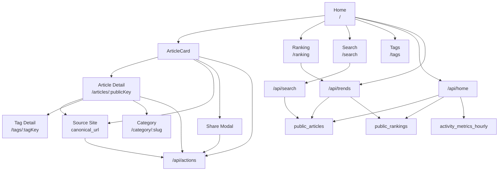

# AI Trend Hub Screen Flow

最終更新: 2026-03-21

## 1. 目的

公開画面の導線、主要 API、L4 接続点を一枚で把握するための資料。

## 2. 主要画面

1. Home `/`
2. Ranking `/ranking`
3. Search `/search`
4. Article Detail `/articles/:publicKey`
5. Category `/category/:slug`
6. Tags `/tags`, `/tags/:tagKey`
7. About `/about`
8. Feed `/feed`, `/feed.xml`
9. Digest `/digest`

## 3. 画面遷移と API 接続

## 4. 画面別の読み先

### 4.1 Home

1. `public_articles`
2. `public_rankings`
3. `activity_metrics_hourly`

### 4.2 Article Detail

1. `public_articles`
2. `public_article_tags`
3. `public_article_sources`

### 4.3 Ranking

1. `public_rankings`
2. `public_articles`

### 4.4 Search

1. `public_articles`

### 4.5 Tags / Category

1. `tags_master`
2. `public_article_tags`
3. `public_articles`

## 5. 現在の前提

1. `public_articles` は半年以内の公開集合
2. 半年超は `public_articles_history` に月次退避
3. `content_language` は公開面まで反映済み
4. `thumbnail_url` は内部テンプレサムネイル方式
5. Topic Group は Home 内セクション止まりで、専用画面は未実装

## 6. 次の画面系タスク

1. admin Phase 3
2. Topic Group 本実装
3. OGP 実装
4. `critique` UI
