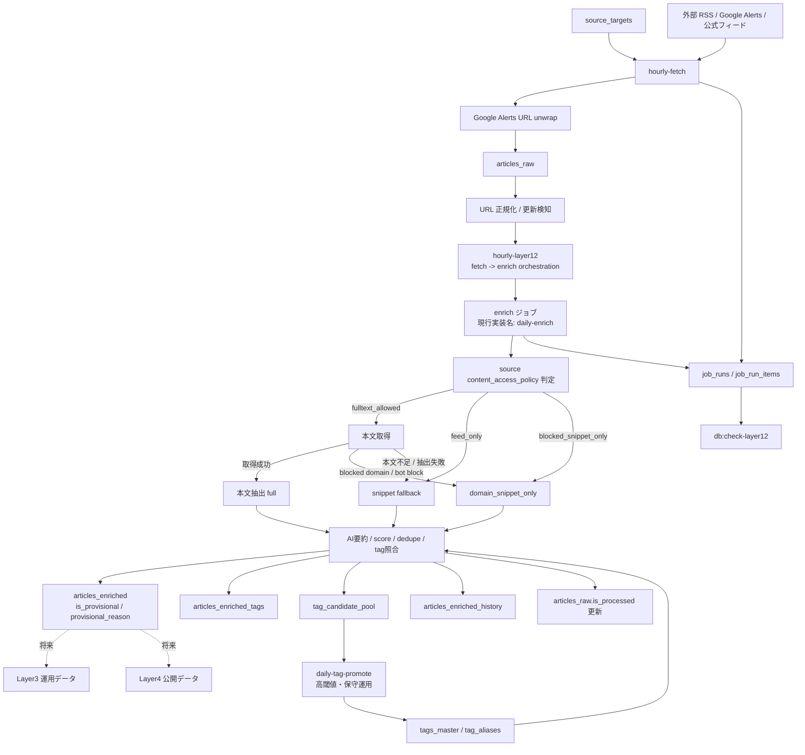

# AI Trend Hub データフロー

最終更新: 2026-03-15

## 1. 現行認識

1. 取得開始点は `source_targets`
2. `hourly-fetch` が `articles_raw` を更新する
3. Google Alerts URL は `google.com/url?...` ではなく実記事 URL に unwrap してから保存する
4. `daily-enrich` は現行実装名だが、運用上は「毎時 enrich」の役割で使っている
5. route `hourly-layer12` が `hourly-fetch -> daily-enrich` を直列実行する
6. `Layer2` では本文取得できない記事も `snippet` ベースで仮蓄積する
7. 仮蓄積状態は `is_provisional` / `provisional_reason` で保持する
8. blocked domain は障害と混ぜず `domain_snippet_only` として扱う
9. `job_runs` / `job_run_items` でジョブ監視する
10. `Layer3` / `Layer4` は今夜の主対象ではない
11. `source_targets.content_access_policy` を先に見て、`feed_only` source は本文 fetch しない
12. 要約 provider は `Gemini(primary) -> Gemini(secondary) -> OpenAI gpt-5-mini -> template fallback` の順で試し、template fallback 行は publish 用には使わない
13. `articles_raw.title` は生データ保持用であり、ローカライズや要約タイトル置換の対象にしない

## 2. 今夜の更新対象

1. `daily-enrich` 相当ジョブを、毎時直列実行と小分け処理に合わせて整理する
2. `Layer2` に「本文未取得 / 仮蓄積」フラグを追加する
3. GitHub Actions で `fetch -> enrich` を直列に回す前提へ寄せる
4. タグ候補は高閾値・保守的昇格を前提にする

## 3. フロー図

## 4. 補足

1. 今夜の主目的は `Layer2` 蓄積開始であり、`full` 抽出率の最大化そのものではない
2. `snippet` でも情報価値があれば `Layer2` に仮蓄積する
3. `publish_candidate` は provisional でない記事だけを候補にする
4. blocked domain は再取得戦略が見つかるまで `snippet-only` を許容する
5. source policy に反する本文取得はしない
6. `template fallback` に落ちた行は Layer2 に残してよいが、`publication_basis=hold` に寄せる
